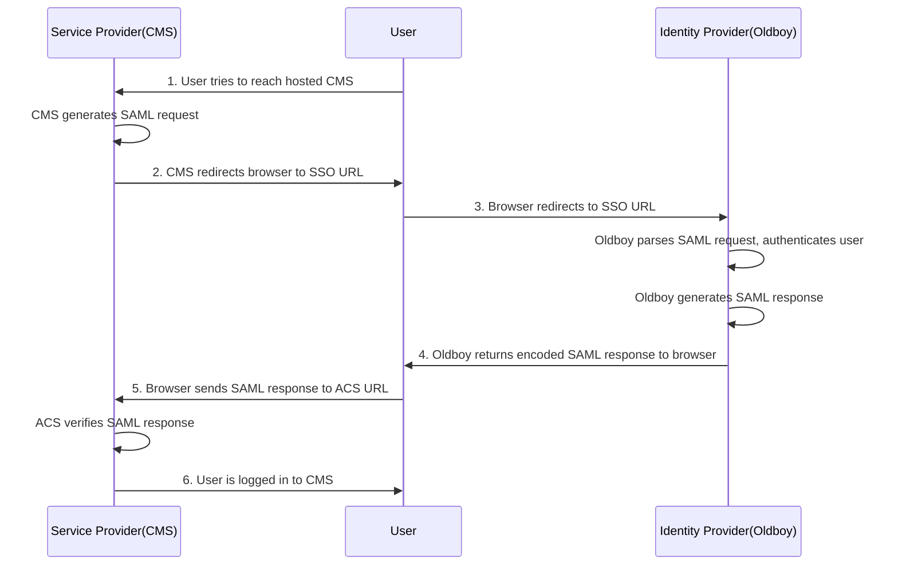
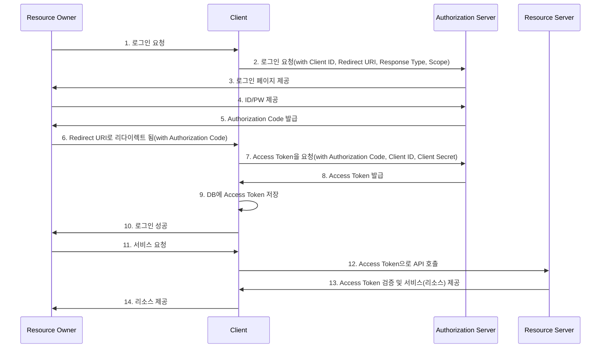

# SAML(Security Asserting Markup Language)
- 인증 정보 제공자와 서비스 제공자 간의 인증 및 인가 데이터를 교환하기 위한 XML기반의 표준 데이터 포맷

## 주요 요소
- SP(Service Provider): 클라이언트가 접근하려는 애플리케이션 또는 서비스
- IDP(Identity Provider): 사용자를 인증하고 SAML Assertion을 발행
- SAML Assertion: 사용자명, 권한 등의 내용을 적은 XML 문서(변조를 막기 위해 전자서명 됨)

## SAML Workflow

1. 서비스 요청
    1. 유저가 서비스에 접근합니다. `SP`는 해당 유저의 인증 여부를 체크합니다.
    
2. SSO 서비스 이동
    1. 인증되지 않은 유저라면, 인증 요청을 생성하여 클라이언트에 전송합니다.
    2. `SP`에서 `SAML request`를 생성하여 유저에게 전송합니다.
    3. `SP`는 `IDP`와 직접 연결되지 않고 유저의 브라우저에서 `IDP`로 `SAML request`를 redirect하게 합니다.
    
3. SSO 서비스 요청
    1. `IDP`는 `SAML request`를 파싱하고 유저 인증을 진행합니다.
    2. 인증 방식은 패스워드, PKI등 다양하게 사용될 수 있습니다.
    
4. SAML 응답
    1. 인증이 성공하게 되면 `SAML response`를 생성하여 유저의 브라우저로 전송합니다.
    2. `SAML response`에는 `SAML Assertion`이 포함됩니다.
    3. `IDP`는 웹 브라우저에 Session Cookie를 설정하고 해당 정보는 브라우저에 캐싱 됩니다.
    
5. SAML 응답 전송
    1. 유저는 `SP`의 `ACS`의 URL에 `SAML response`를 `POST` 전송 합니다.
    
6. 서비스 응답
    1. `ACS`는 `SAML response`를 검증하고 유효하다면 유저가 요청한 서비스로 유저를 `Forwarding` 합니다.
    

## 단점
- `SAML request`, `SAML response`가 XML형식이어서 브라우저를 통해서만 동작 가능
- 모바일이나 Native Application에는 부적절한 형식

# OAuth 2.0(Open Authorization 2.0)
- 인증을 위한 개방형 표준 프로토콜

## OAuth 2.0 주체
- Resource Owner: 타사 플랫폼에서 리소스를 소유하고 있는 사용자
    - 타사 플랫폼: 구글, 페이스북 등
    - 리소스: 구글 캘린더 정보, 페이스북 친구 목록 등
- Authorization Server: Resource Owner를 인증하고, Client에게 액세스 토큰을 발급해주는 서버
- Resource Server: 구글, 페이스북과 같이 리소스를 가지고 있는 서버
- Client: Resource Server의 리소스를 이용하고자 하는 서비스

## OAuth 2.0 Workflow

1. 로그인 요청
    1. Resource Owner가 로그인을 요청합니다.
2. 로그인 요청
    1. Client는 사용자의 브라우저를 Authorization Server로 보냅니다.
    2. Authorization Server가 제공하는 Authorization URL에 `response_type`, `client_id`, `redirect_uri`, `scope` 등의 매개변수를 쿼리 스트링에 포함하여 보냅니다.
3. 로그인 페이지 제공
    1. Authorization Server에서 로그인 페이지를 제공합니다.
4. ID/PW 제공
    1. Resource Owner는 제공된 로그인 페이지에 ID/PW를 입력합니다.
5. Authorization Code 발급
    1. Authorization Server는 Redirect URI에 Authorization Code를 포함하여 Resource Owner를 리다이렉트 시킵니다.
    2. Authorization Code란 Client가 Access Token을 획득하기 위해 사용하는 임시 코드입니다.
6. Redirect URI로 리다이렉트
    1. Resource Owner는 Redirect URI로 리다이렉트 됩니다.
7. Access Token 요청
    1. Client는 Authorization Server에 Authorization Code를 전달하고 Access Token을 요청합니다.
8. Access Token 발급
    1. Authorization Server는 Client에 Access Token을 발급합니다.
9. DB에 Access Token 저장
    1. Client는 발급 받은 Resource Owner의 Access Token을 DB에 저장하고, 이후 Resource Server에서 Resource Owner의 리소스에 접근하기 위해 Access Token을 사용합니다.
10. 로그인 성공
    1. Client는 Resource Owner에게 로그인이 성공하였음을 알립니다.
11. 서비스 요청
    1. Resource Owner가 Resource Server의 리소스가 필요한 기능을 Client에 요청합니다.
12. Access Token으로 API 호출
    1. Client는 Resource Owner의 Access Token을 사용하여 Resource Server의 API를 호출합니다.
13. Access Token 검증 및 서비스 제공
    1. Resource Server는 Access Token을 검증하고 리소스를 Client에 제공합니다.
14. 리소스 제공
    1. Client는 Resource Owner에게 리소스를 제공합니다.